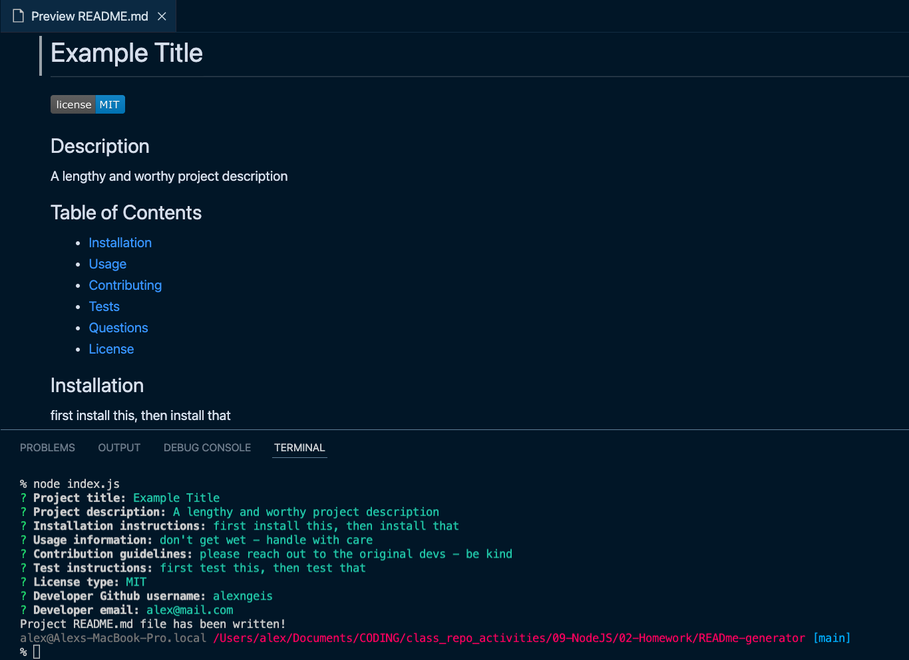

Below is an example of the readme generator output:

# Example Title

## Description

A lengthy and worthy project description

## Table of Contents

- [Installation](#installation)
- [Usage](#usage)
- [Contributing](#contributing)
- [Tests](#tests)
- [Questions](#questions)
- [License](#license)

## Installation

first install this, then install that

## Usage

don't get wet - handle with care

## Contributing

please reach out to the original devs - be kind

## Tests

first test this, then test that

## Questions

alexngeis
alex@mail.com

---

## License

MIT license

## Deploment/Review Details

[READme Generator - Video Walkthrough](https://drive.google.com/file/d/1OepECp294ohOp8qB7u51aLrawRBkTLH3/view)

[Github Repo - READme Generator](https://github.com/alexgeis/READme-generator)

